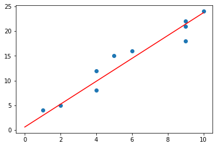

# Lab Assignment

For Python and Machine Learning Interest Group.

## Introduction

**Gradient descent** (GD) is an iterative first-order optimisation algorithm used to find a local minimum/maximum of a given function. This method is commonly used in *machine learning* (ML) and *deep learning*(DL) to minimise a cost/loss function (e.g. in a linear regression). Due to its importance and ease of implementation, this algorithm is usually taught at the beginning of almost all machine learning courses.

However, its use is not limited to ML/DL only, it’s being widely used also in areas like:

- control engineering (robotics, chemical, etc.)
- computer games
- mechanical engineering

## Implementing Gradient Descent Algorithms

In this Lab, we will implement a Linear Regression with Gradient Descent. Your task is to get the coefficients(k and b) of regression line via Gradient Descent. It might be a little bit hard, but don't worry, you ==just writing the codes following by given instructions==.

### Regression data and regression line

```python
x = [1, 2, 4, 4, 5, 6, 9, 9, 9, 10]
y = [4, 5, 8, 12, 15, 16, 18, 21, 22, 24]
```

$\text{Regression Line}: y = 2.310601 \times x + 0.599747$



## Procedure

**Program loss function:**

==$J(k, b) = \frac{1}{2}\times\sum\limits_{i=0}^{i < n}{(k \times x_i + b - y_i)^2}$==

```python
def loss(self, k, b):
    return # you need to implement here
```

**Calculating Partial derivatives: **

==$\text{dk} \leftarrow \frac{\partial J(k, b)}{\partial{k}} = \sum\limits_{i=0}^{i<n}{[(k \times x_i + b - y_i) \times x_i]}$==

==$\text{db} \leftarrow \frac{\partial J(k, b)}{\partial{b}} = \sum\limits_{i=0}^{i<n}{(k * x_i + b - y_i)} $==

**Applying Gradient Descent Algorithms:**

$\alpha = 0.0001$

$k \leftarrow k - \alpha \times \frac{\partial J(k, b)}{\partial{k}}$

$b \leftarrow b - \alpha \times \frac{\partial J(k, b)}{\partial{b}}$

```python
def gradient_descent(self, alpha=0.0001, iterations):
    for i in range(iterations):
      	dk = # you need to implement here
        db = # you need to implement here
        self.k = self.k - alpha * dk
        self.b = self.b - alpha * db
        self.J_history.append(self.loss(self.k, self.b))
    return self.k, self.b
```

## Start Programming

> ==**Basic Reqs. :**==
>
> * You need to replace the placeholders `_____________________` with your code, feel free to add new lines or helper methods.
> * Once you have already finished, run the program and you will get the same output as mine.
> * Tips are given as comments in the code when necessary.
> * If you get stuck, feel free to ask me via Wechat or @me in Wechat Group or Email.
> * ==**Submit your code `<your_name>_pyml_lab.py` or `<your_name>_pyml_lab.ipynb` via Wechat (ID: `ex10si0n-Yan`) or Email (p1908326@ipm.edu.mo)**==
>
> **Extra self-learning (if you like):**
>
> * Once you have finished, try the other `x` and `y` you like.
> * You can test the Linear Regression with any data you like such as: https://www.kaggle.com/quantbruce/real-estate-price-prediction, play it around and debug the model. I promise you will have an amazing discovery.
> * Also tries adjusting variable `alpha` (learning rate) like a Data Scientist. See what you get.
> * Explore much more about Machine Learning at [CS-229](https://cs229.stanford.edu/syllabus.html)
> * Feel free to add more features in my code an turn it to your Project.

```python
class LinearRegression:

    def __init__(self, x, y):
        self.x = x
        self.y = y
        self.k = 0
        self.b = 0
        self.J = self.loss(self.k, self.b)
        self.J_history = []

    def loss(self, k, b):
        # Tips here:
      	# 	program the loss function with given formula
        # 	where x is self.x, y is self.y from class LinearRegression
        # 	which means you can get x_i by for loop all of the indices of 0 ... len(x)
      	loss = _____________________
        return loss

    def gradient_descent(self, alpha, iterations):
        for i in range(iterations):
          	# Tips here:
            # 	program the partial derivatives dk, db
            #		refer the formula from section [Calculating Partial derivatives]
            # 	where k is self.k, b is self.b from class LinearRegression
            # 	notice that the code here is already inside for loop
          	dk = _____________________
            db = _____________________
            self.k = self.k - alpha * dk
            self.b = self.b - alpha * db
            self.J_history.append(self.loss(self.k, self.b))
        return self.k, self.b

    def predict(self, x):
        return self.k * x + self.b

if __name__ == '__main__':

    x = [1, 2, 4, 4, 5, 6, 9, 9, 9, 10]
    y = [4, 5, 8, 12, 15, 16, 18, 21, 22, 24]

    model = LinearRegression(x, y)
    model.gradient_descent(0.0001, 1000)
    print('Regression Line: y = %f * x + %f' % (model.k, model.b))
```

#### Your output should be:

This lab assignment is designed for let you get familiar with Gradient Descent. Once you correctly implemented the three `_____________`'s, I promise you will get same Regression Line as mine. If you do not get the Regression Line as mine, it is also fine to submit. You are welcomed to ask me for more tips.

```
Regression Line: y = 2.310601 * x + 0.599747
```

## Submission

Submit your code `<your_name>_pyml_lab.py` **or** `<your_name>_pyml_lab.ipynb` 

via Wechat (ID: `ex10si0n-Yan`) or Email (p1908326@ipm.edu.mo)